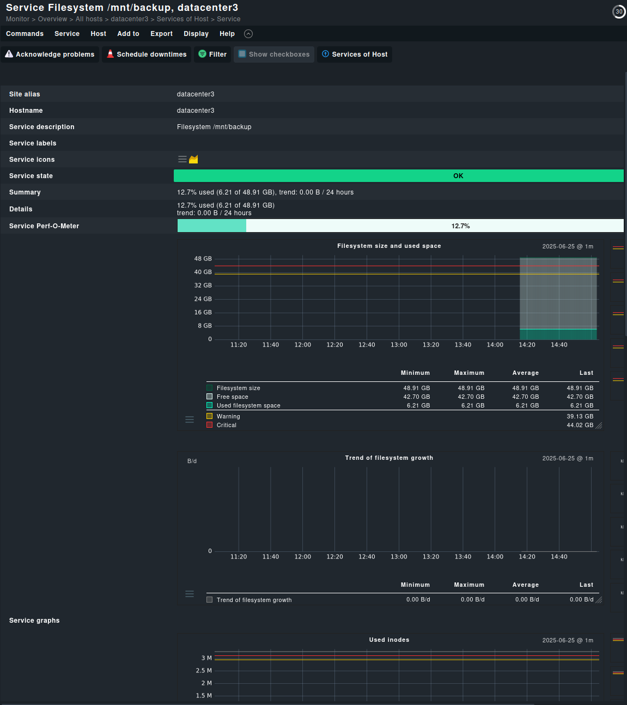

# Rapport de Projet de Groupe - Infrastructure de Monitoring

**Date :** 25 juin 2025  
**Équipe :** Groupe de 4 personnes  :  Joran Ripiego, Leo Goriot, Julien Alleaume, Mathieu Puig
**Sujet :** Mise en place d'une infrastructure de monitoring multi-datacentres  

---

## Table des Matières

- [Rapport de Projet de Groupe - Infrastructure de Monitoring](#rapport-de-projet-de-groupe---infrastructure-de-monitoring)
  - [Table des Matières](#table-des-matières)
  - [Objectifs du Projet](#objectifs-du-projet)
    - [Objectifs Principaux](#objectifs-principaux)
    - [Objectifs Spécifiques](#objectifs-spécifiques)
  - [Architecture Proposée](#architecture-proposée)
    - [Vue d'Ensemble](#vue-densemble)
      - [Datacentres Monitorés](#datacentres-monitorés)
    - [Le cluster Proxmox](#le-cluster-proxmox)
    - [Composants du Système de Monitoring](#composants-du-système-de-monitoring)
    - [Ce que nous avons mis en place](#ce-que-nous-avons-mis-en-place)
    - [Ce que nous n'avons pas pu mettre en place](#ce-que-nous-navons-pas-pu-mettre-en-place)
    - [Regle de masquage pour checkmk](#regle-de-masquage-pour-checkmk)

---

## Objectifs du Projet

### Objectifs Principaux

- Concevoir une architecture de monitoring centralisée pour 4 datacentres
- Implémenter une solution de surveillance en temps réel des services critiques
- Assurer la haute disponibilité du système de monitoring
- Fournir des alertes proactives en cas de dysfonctionnement
- Créer des tableaux de bord (dashboards) pour la visualisation des métriques

### Objectifs Spécifiques

- Monitoring des bases de données (MariaDB, PostgreSQL)
- Surveillance des applications web (WordPress)
- Monitoring des services de traitement (PluxML, StirlingPDF)
- Supervision des systèmes de backup et de streaming
- Mise en place d'alertes configurables
- Documentation complète de la solution

## Architecture Proposée

### Vue d'Ensemble

Notre solution s'articule autour d'une architecture distribuée avec les composants suivants :

#### Datacentres Monitorés

1. **Datacentre 1** (Géré par Mathieu Puig)
   - WordPress 1
   - MariaDB
   - WordPress 2
   - MariaDB

2. **Datacentre 2** (Géré par Joran Ripiego)
   - PluxML 1
   - PluxML 2
   - StirlingPDF

3. **Datacentre 3** (Géré par Julien Alleaume)
   - Services de Backup (proxmox backup)
   - Streaming Vidéo (Plex)
   - Transmission (Qbittorrent et samba)

4. **Datacentre 4** (Géré par Leo Goriot)
   - PostgreSQL
   - PostgreSQL
   - Kresus
   - Git (GitLab)

### Le cluster Proxmox

> Apres votre accord le datacenter2 a disparu dans le neant distordu. (C'est strasbourg, il a brûlé)

### Composants du Système de Monitoring

Nous avons chosi d'utiliser checkmk pour la collecte des métriques et la surveillance des services. Sur DC1 nous avont notre serveur checkmk principal, sur les autres datacentres nous avons des agents checkmk sur lequels on monitore les service du DC.

### Ce que nous avons mis en place

- Service WordPress avec sa base de données MariaDB

Ces services tourne dans des containers LXC sur Proxmox. Nous utilisons un docker-compose qui lie les service wordpress et mariadb. Nous avons mis en place un monitoring de ces services avec checkmk.

- Monitoring des accès aux bases de données MariaDB

- Monitoring des bases des accès aux sites WordPress

- Monitoring de Kresus

- Monitoring de PostgreSQL
 

- Pour les monitoring des machines ou sont les container, en plus de nos sondes, nous avons mis en place un monitoring de l'état des containers avec checkmk.

- Service de partage de fichiers avec Qbittorrent et Samba

- Monitoring du partage de fichiers

- Monitoring du service Plex

- Service de backup Proxmox

- Monitoring du service de backup Proxmox

### Ce que nous n'avons pas pu mettre en place

- Monitoring des liens entre les datacentres

### Regle de masquage pour checkmk

- Regle de mascage de checkmk discovery pour ne pas afficher les services inutiles, Systemd Service Summary et le NTP Time

